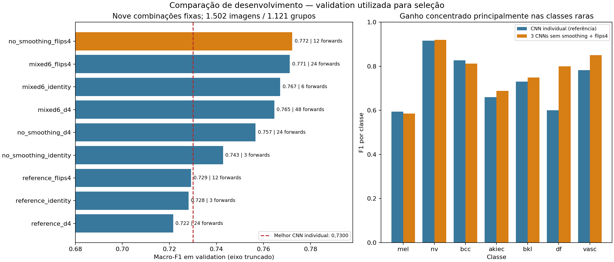

# Melhoria rápida de validation: ensembles e orientações

Orçamento autorizado: até 30 minutos de GPU, priorizando melhorias rápidas.
Não houve novo treinamento, leitura de calibration/holdout, ajuste de thresholds,
rescue, promoção ou mudança na API/modelo operacional.

## Resultado

O melhor resultado entre os nove pipelines declarados foi
**`no_smoothing_flips4`**: três ResNet50 da rodada sem smoothing (seeds 42/43/44),
com média uniforme das probabilidades em quatro vistas: identidade, espelhamento
horizontal, vertical e ambos. São três checkpoints e 12 forwards por imagem.

| Métrica de validation | Melhor CNN individual anterior | Novo conjunto |
|---|---:|---:|
| Macro-F1 | 0,7300 | **0,7722** |
| Accuracy | 0,8409 | **0,8489** |
| Weighted F1 | 0,8416 | **0,8488** |
| Recall de mel | 0,5689 | **0,5808** |
| Precision de mel | **0,6209** | 0,5915 |
| F1 de mel | **0,5938** | 0,5861 |
| Imagens mel corretamente classificadas | 95 / 167 | 97 / 167 |
| Imagens mel classificadas como nv | **48 / 167** | 57 / 167 |

A melhora global não resolve melanoma: há apenas dois acertos adicionais nessa
classe, queda de precision/F1 de mel e aumento de mel→nv. O guard de recall
previamente definido não protege todos os tipos de erro. Não foi redefinido
retroativamente para esconder esse trade-off ou escolher outro vencedor.
Critérios de utilização clínica não foram estabelecidos por este experimento.

O ganho de macro-F1 é **0,04219** frente ao melhor modelo individual, não frente
à média das seeds (esses são objetos diferentes). O IC de 95% do macro-F1 por
grupos é **[0,7194; 0,8086]**; o intervalo pareado da diferença é
**[0,0083; 0,0773]**, reamostrando os mesmos grupos de lesão em ambos os modelos.
Esses intervalos são condicionados à seleção adaptativa em validation. Não são
teste confirmatório independente nem corrigem a busca entre nove candidatos.

## Método e rastreabilidade

1. Verificados seals, seis checkpoints, configs, predições, ordem das classes,
   IDs, lesões, grupos e dataset/split.
2. Comparados três ensembles uniformes nos logits existentes. O desenho reconhece
   que esses scores já tinham sido explorados antes da persistência formal.
3. Declarados nove pipelines de TTA antes da nova inferência: três famílias de
   modelos × identidade / quatro espelhamentos / oito orientações D4.
4. Executadas vistas exatas por flip/rotação de 90°, sem interpolação, recorte,
   padding ou escolha de orientação por label.
5. Confirmada paridade da vista identidade com os logits originais. Média de
   probabilidades por vista e modelo; nenhum peso aprendido ou temperatura.
6. Selecionado o maior macro-F1 dentre os candidatos com recall de mel ao menos
   igual ao candidato individual de referência. Empates favorecem menos forwards.
7. Salvos logits por vista, predições/IDs, métricas, confusões, bootstrap por grupos,
   hashes, ambiente, código e todos os resultados, inclusive os desfavoráveis.

O estudo TTA levou **96,56 s de ponta a ponta**, dos quais **49,47 s** foram medidos
nos forwards CUDA sincronizados. Esses tempos descrevem o estudo em batch; não representam
latência individual. O benchmark de uso individual fica registrado separadamente.

## Verificação e latência individual

**118 testes passaram** na suíte `tests/` em 13,66 s. Os novos testes cobrem
alinhamento/seeds/classes nos ensembles, oito geometrias exatas, média de
probabilidades, bootstrap pareado por grupos e verificação do contrato de
inferência. Não foram executados testes da API, que não foi alterada.

O carregador individual/batch foi verificado em **14 imagens de validation,
duas por classe**, contra as predições persistidas. Erro máximo absoluto nas
probabilidades: **5,83e-7**. Também passaram paridade single/batch e rejeição de
imagem corrompida.

| Medição local na RTX 5080 | Mediana por imagem |
|---|---:|
| CNN individual de referência | 8,13 ms |
| Três CNNs sem smoothing + flips4 | 55,82 ms |

Benchmark: dez chamadas após três aquecimentos, batch 1, uma mesma imagem de
validation, modelos já carregados, decode/preprocessing/forward incluídos;
sem API, rede ou leitura de disco na região cronometrada. Carregamento inicial
do conjunto: 1,67 s. Não representa latência p95 de produção ou distribuição de
latências para imagens de tamanhos variados. Os números completos, flags
numéricas e hashes de implementação estão em
[inference_verification_final.json](inference_verification_final.json).

## Resultados completos e custo

| Família | Vistas | Macro-F1 | Recall mel | Forwards/imagem |
|---|---|---:|---:|---:|
| Referência, 3 CNNs | Identidade | 0,7281 | 0,5749 | 3 |
| Referência, 3 CNNs | Flips4 | 0,7293 | 0,5629 | 12 |
| Referência, 3 CNNs | D4 | 0,7216 | 0,5808 | 24 |
| Sem smoothing, 3 CNNs | Identidade | 0,7428 | 0,5569 | 3 |
| **Sem smoothing, 3 CNNs** | **Flips4** | **0,7722** | **0,5808** | **12** |
| Sem smoothing, 3 CNNs | D4 | 0,7566 | 0,5868 | 24 |
| Misto, 6 CNNs | Identidade | 0,7671 | 0,5749 | 6 |
| Misto, 6 CNNs | Flips4 | 0,7712 | 0,5808 | 24 |
| Misto, 6 CNNs | D4 | 0,7646 | 0,5868 | 48 |

O conjunto misto sem TTA é uma alternativa de custo: macro-F1 0,7671 com seis
forwards, mas seis checkpoints (~566 MB). O vencedor usa três checkpoints
(~283 MB) e 12 forwards. Não assumimos que número de forwards seja uma medição
de latência; custo real depende do batch, hardware, carregamento e cache.

## Artefatos e código

- [Comparação em CSV](comparison.csv), [métricas por classe](per_class_comparison.csv),
  [evidência e intervalos](evidence.json), [figura vetorial](comparison.svg).
- Estudo original, imutável:
  `reports/experimental_v2/tta/d4_study_20260930T020126377530Z/`.
- Ensembles sem nova inferência:
  `reports/experimental_v2/ensembles/uniform_ensembles_v2_20260930T020022093211Z/`.
- `scripts/v2_ensembles.py`: ensembles de logits persistidos, sem imagens/GPU.
- `scripts/v2_tta.py`: inferência em validation com orçamento e família de vistas.
- `scripts/ensemble_inference.py`: uso individual/batch do candidato registrado;
  valida manifesto/checkpoints e reutiliza preprocessing/vistas/agregação.
- [Guia de uso](../../../../docs/ensemble_tta_v2.md): exemplo de inferência,
  opções numéricas e limites do contrato experimental.

Nos artefatos TTA originais, `validation_prediction_manifest.json` conserva o
nome de compatibilidade `checkpoint_sha256`, mas seu valor é **o pipeline_id**,
hash do contrato do ensemble, não de um checkpoint individual. Os hashes reais
dos checkpoints estão vinculados pelo design/manifests de membros. A inferência
explicita essa identidade e o formato `log_probabilities_of_uniform_mixture`.
Os logits agregados não são logits crus de uma única CNN.

Depois do estudo foram reforçadas verificações sem alterar os resultados selados:
deadline por vista (além de por batch), comparação explícita de lesão/grupo e
metadados explícitos do alias de identidade nos próximos pipelines. Os seis
artefatos existentes foram novamente conferidos contra os IDs/grupos certificados.

## Limites e próximo passo

Este é um candidato experimental reutilizável, sem freeze/promoção/deploy. O gate
atual de uma CNN individual não deve receber um ensemble como se fosse um único
checkpoint. Uma integração futura precisa versionar esse contrato e sua decisão
antes de qualquer avaliação reservada.

Validation já foi utilizada repetidamente; o estudo reconhece essa exposição.
Não há patient_id disponível nem teste externo independente. O holdout interno
não foi aberto ou utilizado para decidir entre esses candidatos.

Para uma rodada de treinamento posterior, as hipóteses prioritárias são rever a
interação entre suavização e ponderação da loss, preservar melhor o backbone no
fine-tuning e alinhar early stopping ao cosine scheduler. Exigem novo plano,
mesmas seeds e orçamento próprio; não foram implementadas sem medição nesta fase.
